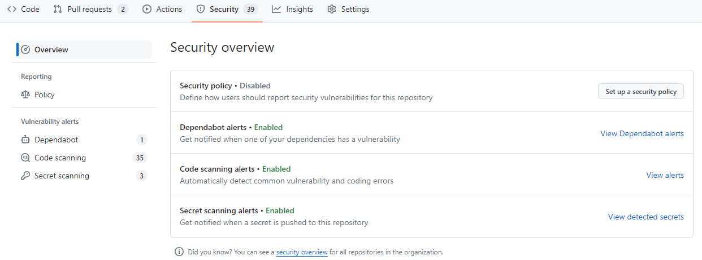

# Sikkerhetsvask av Git-repositories ved open sourcing

Før et repository endres til `public` på Github må det gjøres en kvalitetssikring av det som legges ut. Dette skal sikre at sensitiv informasjon ikke kommer på avveie.

Sensitiv informasjon inkluderer:

- Personopplysninger, herunder fødselsnumre, navn, adresser, og telefonnumre
- Passord og andre tilgangsnøkler
- Nettverkstopologi
  - Som hovedregel skal det ikke ligge IaC-kode i et offentlig repo. Se [retningslinjer for åpen IaC-kode](retningslinjer-for-åpen-iac-kode.md).

Eksempler på sårbarheter kan være:

- Avhengighet på programbiblioteker der det foreligger sikkerhetshull (se [sårbarhetsscan](sårbarhetsscan.md))
- API-endepunkter som ikke er tilstrekkelig sikret
- Tilbøyelighet for Denial of Service (DoS-angrep)

## Krav før open sourcing

- [ ] Det skal ikke være **åpne** sikkerhetsvarsler i GitHub når repoet endres til `public`.\
      Når det gjelder kodeskanning så er det lov å "dismisse" et varsel iht. de årsakene som er mulig å oppgi i GitHub (false positive, used in tests, not relevant), men det skal alltid grunngis hvorfor dette varselet ikke er et problem.

## Fremgangsmåte

Gjør et [søk i Git-historikken](#søke-etter-sensitiv-informasjon) etter sensitiv informasjon. Dersom slik informasjon foreligger, må [Git-historikken skrives om](#skrive-om-git-historikk).
Det er ikke nok å slette informasjonen i en ny commit.

Gjør `git rebase` og skriv om commit-meldinger der det trengs. Se [om å skrive gode commit-meldinger](commit-meldinger.md) for tips og råd.

Dersom Git-historikken er omskrevet, må det gjøres en force push til upstream. Alle utviklere må slette sin lokale kopi, og sjekke ut repoet på nytt.

## Skrive om Git-historikk

Bruk [BFG Repo Cleaner](https://rtyley.github.io/bfg-repo-cleaner/) og følg fremgangsmåten i dokumentasjonen.

## Søke etter sensitiv informasjon

Blant verktøy for å søke, finnes:

- [git-secrets](https://github.com/awslabs/git-secrets)
- [Repo-supervisor](https://github.com/auth0/repo-supervisor)
- [Truffle Hog](https://github.com/dxa4481/truffleHog).
